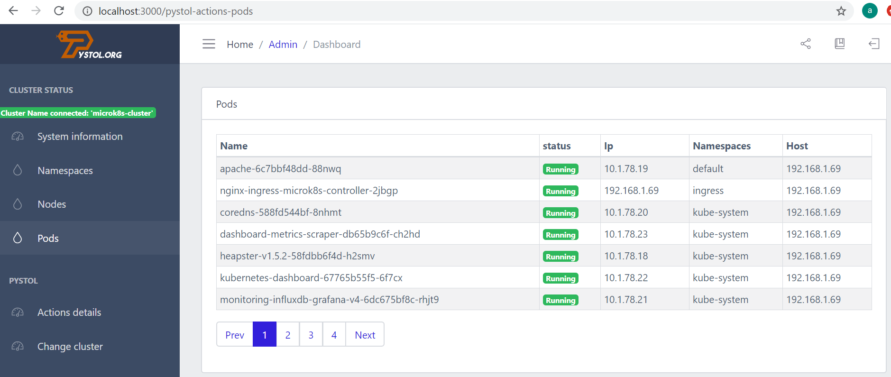

## Client fot Pystol in Docker


This run will create a container called pystol-client with the latest version of Pystol.

The client have two function very important.
- Is a terminal client Pystol 
- It's have a intuitive Web Interface 



- Clone repo

```
https://github.com/agustinjaume/Pystol-client-in-docker.git
```

- Run command in trerminal 

At the end of the process, it will show the cluster that is connected on the screen.
```
. deploy.sh
```

- Copy our kubeconfig.yml file into the kubeconfig folder
```
/path/kubeconfig/kubeconfig.yml
```
 
- Run script file to generate image and we will  at copy kubeconfig inside container
```
. /deploy.sh
```

- Manually copy a new kubeconfig.yaml to insight container Pystol client
```
. /update_kubeconfig.yml
```

- Access to container Pystol client

```
docker exec -it pystol-client sh
sh-4.4# pystol --version
pystol 0.5.15
sh-4.4#
```
